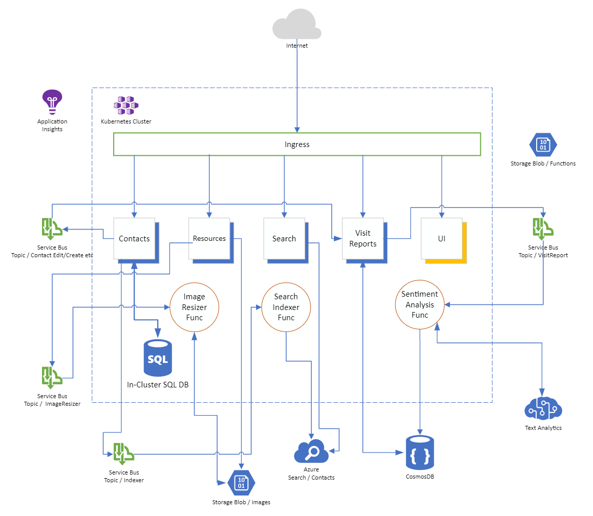

# Azure Chaos Studio Sample Environment

To create the sample environment, use the terraform script in folder `terraform` :

```shell
cd terraform
terraform init --upgrade
terraform apply -var="prefix=<CHOOSE_A_PREFIX>"
```

The prefix will be used for naming resources created in Azure. It must not be longer than 6 characters (e.g. `-var="prefix=chaos1"`).

The environment consists of a sample application running in an AKS cluster. High-level architecture:



## Azure Components Involved

- Azure Kubernetes Service
  - NGINX Ingress Controller
  - Four micro-services (.NET Core / NodeJS)
  - SPA Frontend (VueJS / nginx)
  - Multiple Azure Functions for background processing of messages
- Azure Service Bus (topics/queues)
- Azure Storage Account
- Azure SQL DB
- Azure Cosmos DB
- Azure Search
- Azure Cognitive Services

## Chaos Experiments

The environment will also consist of 3 Chaos Experiments in Azure Chaos Studio, targeting workloads running in the Kubernetes cluster and Cosmos DB. The Azure resources are automatically onboarded to Azure Chaos Studio and the identities created for the experiments will have the appropriate permissions in the target resources (all done in the terraform script).

To run the experiments, go to the Azure Chaos Studio, select one experiment and click "Run" in the toolbar.

### Experiment 1

|                       |                                                                                                                                                                                                                   |
| --------------------- | ----------------------------------------------------------------------------------------------------------------------------------------------------------------------------------------------------------------- |
| Target                | Contacts Service                                                                                                                                                                                                  |
| Experiment            | Service failure                                                                                                                                                                                                   |
| Hypothesis            | Kubernetes detects the failure of a pod via its health endpoint and immediately starts a new instance. Users will only be affected by the time Kubernetes needs to query the health endpoint and create new pods. |
| Steady State          | The Contacts Service responds with HTTP Response Code 200 and an average response time of less than 200ms.                                                                                                        |
| Blast Radius          | The experiment involves only the Contacts Service. The Contact App UI and all other use cases are fully available.                                                                                                |
| Technical information | Failure simulation via AKS Pod Chaos (pod-failure)                                                                                                                                                                |

### Experiment 2

|                       |                                                                                                                                                                |
| --------------------- | -------------------------------------------------------------------------------------------------------------------------------------------------------------- |
| Target                | Cosmos DB                                                                                                                                                      |
| Experiment            | Region Outage                                                                                                                                                  |
| Hypothesis            | In case of an outage of a whole region, Cosmos DB will fail-over to another region. Users won’t be affected at all.                                            |
| Steady State          | Application will use region „Europe West“ as ist primary region.                                                                                               |
| Blast Radius          | The experiment involves the Cosmos DB / Visit Reports Service and background worker functions. The Contact App UI and all other use cases are fully available. |
| Technical information | Failure simulation via Cosmos DB Failover fault                                                                                                                |

### Experiment 3

|                       |                                                                                                                                                                                                            |
| --------------------- | ---------------------------------------------------------------------------------------------------------------------------------------------------------------------------------------------------------- |
| Target                | Contacts Service                                                                                                                                                                                           |
| Experiment            | Service CPU pressure                                                                                                                                                                                       |
| Hypothesis            | In case high user-load hitting the Contacts Service, Kubernetes will scale the service out horizontally. After the load drops, Kubernetes will scale in again. Users won’t see any outages of the service. |
| Steady State          | Contacts Service is running with 1 replica.                                                                                                                                                                |
| Blast Radius          | The experiment involves the Contacts API. The Contact App UI and all other use cases are fully available.                                                                                                  |
| Technical information | Failure simulation via AKS Stress Chaos (CPU stressor)                                                                                                                                                     |

## Simulate User Load

To simulate users using the application, you can leverage the Azure Load Testing service. Included in this repo, you can find a JMeter file (folder `jmeter`) that can be used in the Azure Load Testing service. Simply create a test, upload the JMeter file and adjust the BASE_URL parameter for the application endpoint (you will get the value after the terraform script has finished, something like `20-34-132-155.nip.io`).

## Known Issues

Azure Chaos Studio experiments and targets aren't supported in terraform yet. The corresponding resources are created via an inline ARM template, see the script in module `chaos`. Tearing down the environment sometimes doesn't fully work, so it could be that you need to clean-up resources manually (welcome to terraform 😘).
